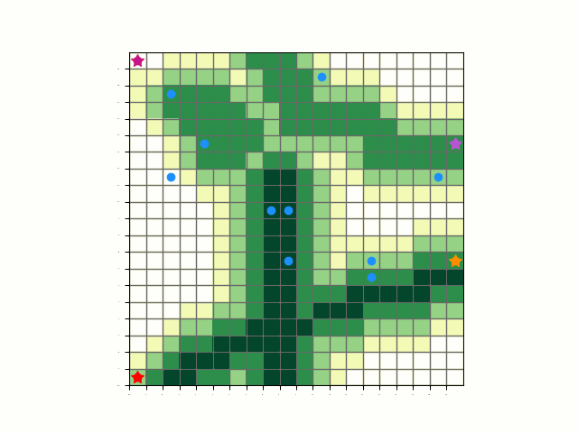

# Unmanned Aerial Vehicles for Search and Rescue

Improve path plotting of unmanned aerial vehicles (UAVs) search and rescue (SAR) algorithms. Received Honorable Mention at the TJ Science Fair and were alternates for Regionals. Our project poster can be found in [Poster.pdf](Poster.pdf). Additionally, the project proposal ([Project_Proposal_MIT_THINK.pdf](Project_Proposal_MIT_THINK.pdf)) was submitted to MIT THINK.

According to the National Park Service (NPS) Search and Rescue (SAR) missions are on the rise from around 1403 to 1470 cases from January to June 2018 to the same months in 2021. Time is vital in SAR missions: survival chances of a missing person are high if found within the first day, but drastically drop to almost zero after just 48 hours. UAVs have recently become popular due to their speed and efficiency; however, many algorithms don’t take advantage of factors like human behaviors in their calculations. We introduce a novel approach to SAR that uses geographic information as well as lost persons behavior to create an algorithm for multi-UAV swarms. The goal of our project was to decrease the overall time of SAR operations by incorporating survival behavior models with optimized path plotting. We created a probability map of the search region using the survival models and geographic APIs provided by NPS to predict where the targets are most likely to be. The region was divided among the UAVs in the swarm and with the corresponding probability map provided to each UAV. We also established a new path plotting algorithm to utilize our probability map by generally searching areas of the regions with higher priority first. As a result, initial testing showed our approach led to a 46% decrease in time to complete SAR missions. In the future we hope to implement the Detectron2 image residual networks (ResNets) for target recognition and dynamically updates the probability map with new information.

Here is a visual demonstration of our final algorithm:

